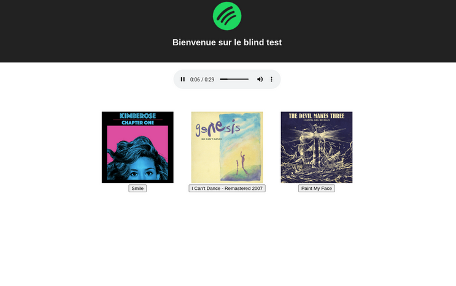

# Dojo Blind Test

## Contexte

Ce repository a été créé pour le dojo du 11/04/2023. C'est une mise à jour du fameux "blind test Spotify".

## Le résultat

Au premier chargement, la liste des chansons enregistrées (_liked songs_) de l'utilisateur sont récupérées sur l'API de Spotify.

La `preview_url` est utilisée pour jouer la chanson. L'utilisateur doit trouver le titre de la chanson parmi trois.

## Les technos

- application : React, Typescript, react-query
- tooling: pnpm, vite, prettier

## How to contribute

Sur la branche `main` se trouve l'état initial du dojo. Les dépendances utiles tout au long du dojo sont déjà installées.

Les branches `correction/xxx` proposent une correction à différentes étapes.
